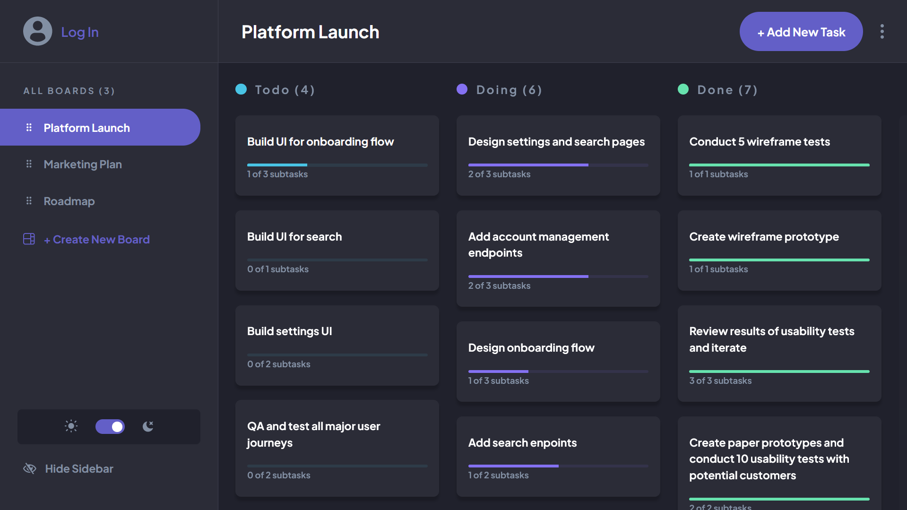

# 🧠Frontend Mentor - Kanban task management web app solution

This is a solution to the [Kanban task management web app challenge on Frontend Mentor](https://www.frontendmentor.io/challenges/kanban-task-management-web-app-wgQLt-HlbB). Frontend Mentor challenges help you improve your coding skills by building realistic projects.

## 📜Table of contents

- [Overview](#👁️overview)
  - [The challenge](#🏃‍♀️the-challenge)
  - [Added Features](#💅added-features)
  - [Setup](#🛠️setup)
  - [Screenshot](#📸screenshot)
  - [Links](#🔗links)
- [My process](#🚨my-process)
  - [Built with](#⚙️built-with)

## 👁️Overview

### 🏃‍♀️The challenge

Users should be able to:

- View the optimal layout for the app depending on their device's screen size
- See hover states for all interactive elements on the page
- Create, read, update, and delete boards and tasks
- Receive form validations when trying to create/edit boards and tasks
- Mark subtasks as complete and move tasks between columns
- Hide/show the board sidebar
- Toggle the theme between light/dark modes
- **Bonus**: Allow users to drag and drop tasks to change their status and re-order them in a column
- **Bonus**: Keep track of any changes, even after refreshing the browser (`localStorage` could be used for this if you're not building out a full-stack app)
- **Bonus**: Build this project as a full-stack application

### 💅Added Features

- **Color Picking for Each Column**: Users can choose custom colors for individual columns, aiding in visual organization and task categorization.

- **Progress Bar Visualization**: Implement progress bars within cards or columns to visually track task completion and project progress.

- **Add/Edit Column Dialog**: Allow users to add new columns or edit existing ones directly from the kanban board interface for enhanced workflow customization.

- **Access Without Login**: Enable basic access to the app's features without requiring users to log in, improving accessibility and user engagement.

### 🛠️Setup

#### Step 1: Clone Repository

```bash
git clone https://github.com/CarlosSimon02/fem-kanban-task-management
```

```bash
code fem-kanban-task-management
```

#### Step 2: Setup [MongoDB](https://www.mongodb.com/docs/atlas/getting-started/?_ga=2.5998448.2143569430.1714646061-831054883.1714642664) and [Auth0](https://auth0.com/docs/get-started)

#### Step 3: Configure the environment variables in `.env.example` and rename it to `.env`

./frontend

```bash
#you can change this if nodemon provides different ip address
VITE_API_BASE_URL=http://localhost:7000

#you can change this if vite provides different ip address
VITE_AUTH0_CALLBACK_URL=http://localhost:5173/

VITE_AUTH0_DOMAIN=#your-auth0-domain
VITE_AUTH0_CLIENT_ID=#your-auth0-client-id
VITE_AUTH0_AUDIENCE=#your-auth0-audience
```

./backend

```bash
MONGODB_CONNECTION_STRING=#your-mongodb-connection-string

AUTH0_AUDIENCE=#your-auth0-audience
AUTH0_ISSUER_BASE_URL=#your-auth0-issuer-base-url
```

#### Step 4: Install dependencies and run the development server

```bash
cd frontend
```

```bash
npm install
#or
yarn install
```

```bash
npm run dev
```

Create new terminal for the backend

```bash
cd backend
```

```bash
npm install
#or
yarn install
```

```bash
npm run dev
```

### 📸Screenshot



### 🔗Links

- Solution URL: ---> [LINK](https://www.frontendmentor.io/solutions/kanban-board-web-application-developed-with-mern-stack-cdV3o8b__z)
- Live Site URL: ---> [LINK](https://fem-kanban.onrender.com/)

## 🚨My process

### ⚙️Built with

- [React](https://react.dev/): Makes building user interfaces simpler.
- [Radix UI](https://www.radix-ui.com/): A library for building accessible, composable, and flexible UI components in React.
- [Shadcn UI](https://ui.shadcn.com/): A UI component library focused on providing customizable and stylish design elements for web applications.
- [Zustand](https://zustand-demo.pmnd.rs/): Helps manage data in React easily.
- [Vite](https://vitejs.dev/): Quickly builds modern web apps.
- [Express](https://expressjs.com/): Creates web apps using Node.js easily.
- [Node.js](https://nodejs.org/en): Runs JavaScript code outside browsers.
- [MongoDB](https://www.mongodb.com/): Stores data like a flexible spreadsheet.
- [React-Beautiful-Dnd](https://github.com/atlassian/react-beautiful-dnd): Adds drag-and-drop features to React apps.
- [Auth0](https://auth0.com/): Adds secure login to apps easily.
- [Zod](https://zod.dev/): Checks data in TypeScript apps for accuracy.
